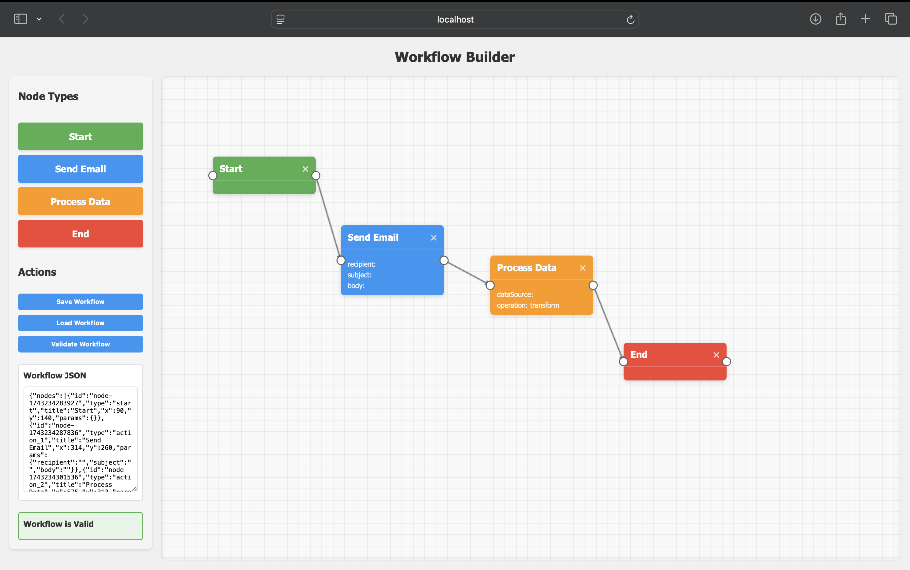

# Workflow Builder

A visual workflow automation builder built with Angular that allows users to create, configure, and validate workflows through an intuitive drag-and-drop interface.



## How to Run the Project

### Prerequisites
- Node.js (v16 or higher)
- npm (v8 or higher)

### Installation
1. Clone this repository
2. Install dependencies
   ```
   npm install
   ```
3. Start the development server
   ```
   ng serve
   ```
4. Open your browser and navigate to http://localhost:4200

## Overview of Design and Architecture Decisions

### Core Architecture
The application follows a component-based architecture with clear separation of concerns:
- **Services**: Centralized workflow state management in WorkflowService
- **Components**: Standalone components for specific UI sections
- **Models**: TypeScript interfaces defining workflow data structures

### Key Technical Decisions

#### 1. Signal-based State Management
- Used Angular's signal API for reactive state management
- Centralized workflow state in a service for consistent data access
- Implemented computed properties for derived values

#### 2. Canvas Implementation
- HTML5 Canvas for rendering connections between nodes
- Absolute positioning for node placement within the canvas
- Custom event handling for drawing connections

#### 3. Drag and Drop
- Native HTML5 Drag & Drop API for node placement
- Custom mouse event handlers for connection creation
- Visual feedback during drag operations

#### 4. Node Configuration
- Dynamic parameter configuration for action nodes
- Type-safe parameter handling
- Easy extensibility for adding new node types

## Features Implemented

### Workflow Builder UI
- Sidebar with 4 node types (Start, Action 1, Action 2, End)
- Canvas area for node placement and connection
- Free positioning of nodes on the canvas
- Visual connections between nodes

### Node Features
- Each node has a title, type-specific color, and shape
- Input and output ports for connections
- Configurable parameters for action nodes

### Connection Handling
- Mouse-based connection between nodes
- Port highlighting on hover
- Visual representation of connections with directional indicators

### Workflow Management
- Save workflow to JSON format
- Load workflow from saved JSON
- Basic validation to ensure workflow integrity

## Technology Stack
- Angular 19
- TypeScript
- SCSS for styling
- HTML5 Canvas API
- Native Drag & Drop API

## Future Enhancements
- Undo/redo functionality
- Additional node types
- More complex validation rules
- Workflow execution simulation
- Data flow visualization

---

This workflow builder demonstrates core Angular concepts including component architecture, reactive programming with signals, and DOM manipulation through custom directives and event handling.
